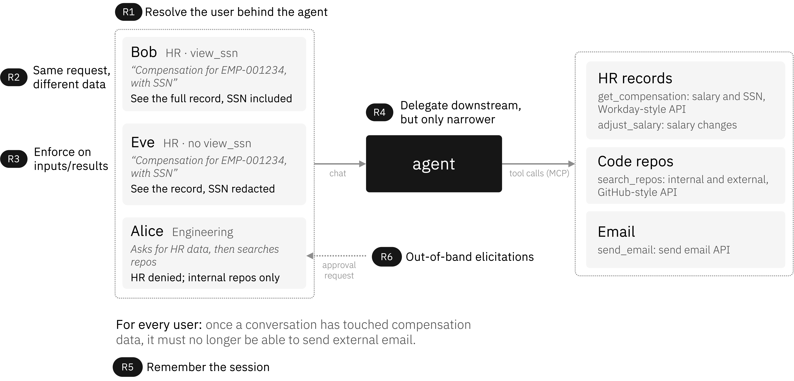
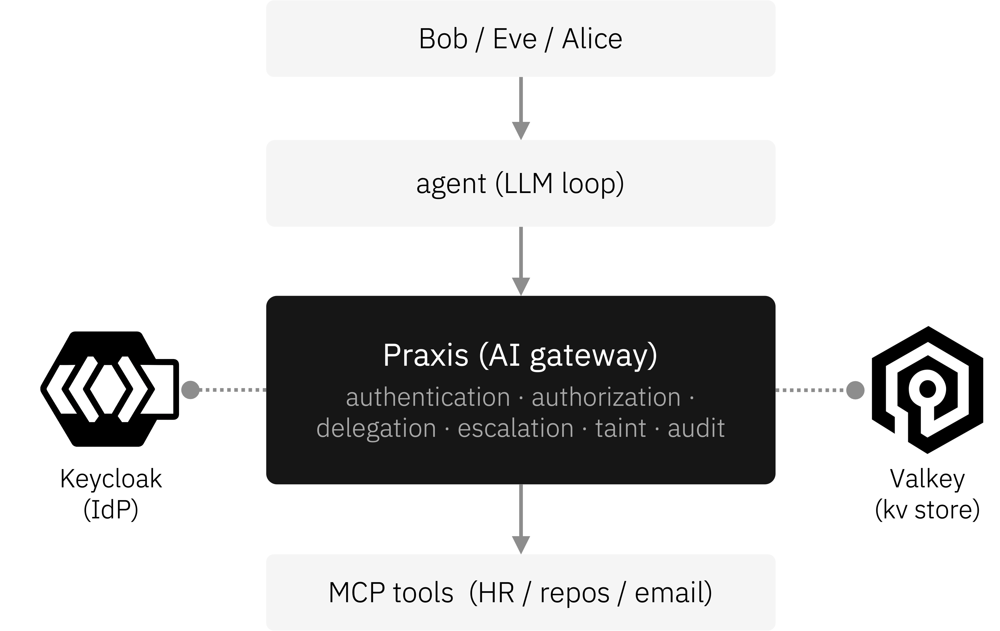

# CPEX Policy Engine Demo

An agent that can call tools can also leak data, exceed a user's privileges, or
act on a credential it should never hold. This demo puts **Praxis** between the
agent and its tools as an identity-aware control point. One policy layer decides
who can call what, what data comes back, and where that data is allowed to go
next.

It is an end-to-end setup of **Praxis** with the feature-gated **`cpex`** filter,
**Keycloak** as the OIDC IdP, and a mock **MCP server**, exercising the full
CPEX/APL (Authorization Policy Logic) stack:

- multi-source identity (user, agent, and workload JWTs in separate headers,
  each validated by its own identity plugin)
- RFC 8693 token exchange (Keycloak Standard Token Exchange v2)
- policy requirements (`require(role.hr)`, `require(team.engineering)`)
- a policy decision point for relationship-based authorization (Cedar or CEL)
- on-the-wire body rewriting (`redact(args.ssn)`; the upstream never sees the value)
- PII scanning on tool arguments
- structured audit emission
- session taint (cross-tool, cross-request data-flow control)
- human-in-the-loop approval (out-of-band manager sign-off over OIDC CIBA)

## Watch it run

The following demo shows an interactive session in front of the gateway, driven by an LLM agent. It covers allow with RFC 8693 token exchange, on-the-wire SSN redaction, session taint, a CEL PDP decision, and a human-in-the-loop manager approval, with the governing policy shown alongside each step.

[](https://asciinema.org/a/NsnafpaR7xzyjm7a)

## Scenario

<p align="center">
  
</p>

A single agent serves three people and reaches three backends over the Model
Context Protocol: HR records, code repositories, and email. Everyone talks to the
same agent, and the agent calls the same tools. Identity decides the outcome.

| Persona | Identity | Result |
|---|---|---|
| Bob | HR, `view_ssn` | Full compensation record, SSN included |
| Eve | HR, no `view_ssn` | Same record, SSN redacted |
| Alice | Engineering | Denied HR tools; allowed internal repos, denied external |

Two outcomes make the value concrete:

- **Same request, different data.** Bob and Eve send the byte-for-byte same
  `get_compensation` request and the backend returns the same record. Eve's
  response comes back without the SSN because the policy redacts it on the wire.
  The tool never makes that call; Praxis does. Bob's request reaches the backend
  with a freshly minted, audience-scoped token, never his original IdP JWT.
- **Data flow follows the conversation.** Once a session has touched compensation
  data, Praxis stops that session from sending external email, even when the email
  body is clean. The taint travels with the session, not the message.

## Architecture

<p align="center">
  
</p>

The agent never talks to a tool directly. Every call passes through Praxis, which
authenticates the caller against Keycloak, runs the policy, and only then forwards
a scoped request to the MCP tool. In a single pass it:

- resolves identity from the user, agent, and workload tokens
- runs the APL gate and a PDP (Cedar or CEL) for relationship-based decisions
- exchanges the user token for an audience-scoped backend token (RFC 8693)
- redacts sensitive fields and scans arguments for PII
- tracks session taint and emits a structured audit record

That is the synchronous pass. Sensitive mutating actions add an **asynchronous,
out-of-band** step: a `require_approval(...)` policy step **suspends** the call
and drives a **human-in-the-loop** manager approval over OIDC CIBA. The gateway
sends a backchannel request to Keycloak, which pushes the prompt to the approver's
"phone" (the auth-channel UI); meanwhile the gateway answers the caller `-32120`
"pending" instead of blocking, and applies the change only once the approver signs
off. See [Human-in-the-loop: manager approval](#human-in-the-loop-manager-approval).

### What runs where

```text
+------------------------------------------------------------------+
| host                                                             |
|                                                                  |
|   cpex-praxis gateway (praxis-ai + policy)   :8090               |
|     filter: mcp            parse JSON-RPC, set mcp.method/name   |
|     filter: policy         identity + APL + PDP + delegation +   |
|                            PII + audit + taint + elicitation +   |
|                            body rewrite                          |
|     filter: router         forward / to the hr-mcp upstream      |
|     filter: load_balancer  single-endpoint cluster               |
+------------------------------------------------------------------+
        ^                                  v
  chat / curl                       hr-mcp-server (Python, docker)
  Authorization + X-User-Token      :9100, receives the rewritten
  (+ X-Session-Id)                  request with the minted token

+------------------------------------------------------------------+
| docker compose                                                   |
|   keycloak  cpex-demo realm: bob/alice/eve users; praxis-gateway |
|             / workday-api / github-api clients; STE v2; CIBA     |
|   hr-mcp    mock MCP server: get_compensation, send_email,       |
|             search_repos, adjust_compensation                    |
|   valkey    :6379, CPEX session store: taint labels keyed by     |
|             H(subject:session_id), durable across gateway restart|
|   auth-     :5001, CIBA approval UI ("the manager's phone");     |
|   channel   Keycloak's channel SPI POSTs pending approvals here  |
+------------------------------------------------------------------+
```

The synchronous request path is `chat / curl -> gateway -> hr-mcp`, with the
gateway calling Keycloak inline for JWT validation and RFC 8693 token exchange.
Human-in-the-loop approval adds a second, **out-of-band** path for
`adjust_compensation` over $10k. The gateway never blocks on it:

```text
1. caller   --tools/call-->  gateway     require_approval suspends the call;
                                          gateway returns -32120 "pending"
2. gateway  --CIBA backchannel-->  keycloak      login_hint = the manager claim
3. keycloak --push (channel SPI)-->  auth-channel :5001   the manager's "phone"
4. approver --Approve/Deny-->  auth-channel  --callback-->  keycloak
5. gateway  --poll-->  keycloak     resolves once the approver acts
6. caller re-sends with X-Policy-Elicitation-Id: peek -> -32121 approved,
   then re-send without peek -> 200 the change applies
```

## Prerequisites

- Docker daemon running (Docker Desktop, Rancher Desktop, or Colima)
- Rust toolchain (whatever praxis's `rust-version` requires)
- Ports `8081`, `8090`, `9100`, `6379`, `5001` free on localhost

## Quick start

`restart.sh` builds praxis if needed, brings up a clean Keycloak and MCP backend,
starts the gateway, and smoke-tests scenario 01. The whole demo is one command:

```bash
# From this directory. First run builds the gateway (~5 min cold, ~30s warm).
# Point it at a praxis checkout: PRAXIS_DIR=<path> or PRAXIS_GIT_URL=<url>.
./restart.sh
./walkthrough.sh
```

The equivalent steps, spelled out:

```bash
GATEWAY_BIN="$(./build-gateway.sh)"   # build the cpex gateway, print its path
docker compose up -d                  # Keycloak + mock MCP server + valkey
./verify-token-exchange.sh            # wait for the realm import, check STE v2
"$GATEWAY_BIN" -c ./praxis.yaml &      # start the gateway
./walkthrough.sh                      # narrated tour of the core scenarios
```

## Configuring the gateway / praxis source

The gateway is a thin crate (`gateway/`) that composes **praxis-ai**'s AI filters
(the `mcp` protocol classifier) with the **CPEX/HIL `policy`** filter: it depends
on praxis-ai's server, enables the `cpex-policy-engine` feature (which registers
`policy`), and `[patch]`es `praxis-proxy-*` to our HIL fork. `build-gateway.sh`
builds it, resolving the fork into the gitignored `gateway/.praxis` (first match
wins):

| Env var | Effect |
|---|---|
| `PRAXIS_DIR` | Path to a local praxis checkout, symlinked as `gateway/.praxis`. |
| `PRAXIS_GIT_URL` (+ `PRAXIS_GIT_REF`, default `feat/hil_apl`) | Cloned into `gateway/.praxis`. |
| existing `gateway/.praxis` | Reused as-is. |

> The HIL (elicitation / CIBA approval) demo needs the `feat/hil_apl` branch. It
> carries the `policy`-filter changes base `main` doesn't. Point `PRAXIS_DIR` at
> a checkout on that branch, or set `PRAXIS_GIT_URL`.

```bash
# From a local praxis checkout:
PRAXIS_DIR=~/src/praxis ./restart.sh

# Or clone a ref from git:
PRAXIS_GIT_URL=https://github.com/terylt/praxis.git PRAXIS_GIT_REF=feat/hil_apl ./restart.sh

# GATEWAY_PROFILE=debug for a faster build; GATEWAY_BIN=<path> to skip building.
```

> Once the HIL changes land upstream, drop the `[patch]` in `gateway/Cargo.toml`
> and the gateway builds against published praxis directly.

## Scenarios

Eleven scenarios cover every feature in the filter. Run any one directly, for
example `./scenarios/01-bob-allow.sh`.

| # | Scenario | Demonstrates |
|---|----------|---|
| 01 | Bob (HR + `view_ssn`) calls `get_compensation` | Identity, APL, RFC 8693 delegation, full record returned |
| 02 | Alice (engineer) calls `get_compensation` | APL `require(role.hr)` deny, JSON-RPC error envelope |
| 03 | Eve (HR, no `view_ssn`) calls `get_compensation` | `redact(args.ssn)` rewrites the body; the tool never sees the SSN |
| 04 | Alice calls `search_repos` for an internal repo | PDP permit (Cedar, or CEL) |
| 05 | Alice calls `search_repos` for an external repo | PDP deny (Cedar `cedar.default_deny`, CEL `cel.policy_denied`) |
| 06 | Bob (HR) calls `search_repos` | APL deny on team membership; the PDP never runs |
| 07 | Bob sends an email with an SSN in the body | PII scanner denies; audit-log still records the attempt |
| 08 | Bob calls `get_compensation` then `send_email` in one session | Session taint: the later email is denied (`session_tainted_secret`) even with a clean body |
| 09 | Eve taints a session id, Bob reuses the same id | Cross-principal isolation: Bob's reuse is a different bucket and is allowed |
| 10 | Bob adjusts compensation by ≤ $10k | Below the threshold: `adjust_compensation` applies immediately, no approval |
| 11 | Bob adjusts compensation by > $10k | Human-in-the-loop: the gateway suspends with `-32120`, Alice approves out-of-band (CIBA), then it applies |

Scenarios 10 and 11 exercise the human-in-the-loop flow described in
[Human-in-the-loop: manager approval](#human-in-the-loop-manager-approval)
below. Scenario 11 needs the full stack (Keycloak CIBA plus the auth-channel UI);
`restart.sh` brings it all up.

## Alternative: CEL instead of Cedar

Scenarios 04 and 05 gate `search_repos` through a policy decision point. The
default config (`cpex.yaml`) uses Cedar. An alternate config (`cpex-cel.yaml`)
expresses the same decision with CEL (Common Expression Language):

```bash
GATEWAY_CONFIG=praxis-cel.yaml ./restart.sh
./scenarios/04-alice-internal-allow.sh        # 200 allow
./scenarios/05-alice-external-cedar-deny.sh   # -32001 deny, violation cel.policy_denied
```

The backends differ in how the rule is authored, not in the outcome:

| | Cedar (`cpex.yaml`) | CEL (`cpex-cel.yaml`) |
|---|---|---|
| Where the rule lives | `policy_text` block (Cedar policy set) | inline `cel: { expr }` on the route |
| The rule | `permit(...) when { principal.roles.contains("engineer") && resource.visibility == "internal" }` | `(has(role.engineer) && role.engineer && args.visibility == "internal") \|\| (has(role.security) && role.security)` |
| Deny reaction | implicit `cedar.default_deny` | `on_deny: [deny('reason', 'cel.policy_denied')]` (a bare default-deny works too) |
| Deny violation code | `cedar.default_deny` | `cel.policy_denied` |
| Best for | versioned or signed policy sets, entity and relationship model | self-contained boolean predicate, no external policy store |

Both PDP backends are compiled into the same binary. The config's
`pdp: { kind: ... }` and the route's `cedar:` or `cel:` step select which one
runs. The CEL step also shows an `on_deny:` reaction attaching a human reason and
a stable violation code; `on_deny` and `on_allow` work on any PDP step.

## Session taint

`get_compensation` runs `taint(secret, session)`, attaching the label `secret` to
the session. `send_email` then refuses to send when the session carries it:

```yaml
# get_compensation
- "taint(secret, session)"

# send_email
- "security.labels contains \"secret\": deny('external email blocked', 'session_tainted_secret')"
```

The produce-then-consume spans two separate tool calls:

1. Produce. `taint(secret, session)` records the label. cpex persists it to the
   session store when the request ends.
2. Persist and scope. The store is keyed by `H(subject : session_id)`. The
   session id comes from the `X-Session-Id` header, which the praxis `cpex`
   filter maps to `agent.session_id`. cpex binds it to the resolved subject, so
   the same id under a different user is a different bucket.
3. Consume. On the next request in that session the stored label is hydrated into
   `security.labels`, and the `send_email` predicate reads it to deny.

```bash
./scenarios/08-bob-taint-deny.sh                   # S3 denied, session_tainted_secret
./scenarios/09-cross-principal-taint-isolation.sh  # S3 allowed, subject-scoped
```

The deny in 08 fires even when the email body is clean. The session is tainted,
not the content, which is what separates it from scenario 07's content-based PII
deny. Scenario 09 shows the taint cannot cross principals.

Tainting is independent of the PDP, so 08 and 09 behave the same under both
`cpex.yaml` and `cpex-cel.yaml`.

### Where taint is stored

Both configs point `global.session_store` at Valkey:

```yaml
global:
  session_store:
    kind: valkey
    endpoint: localhost:6379
```

So labels live in the `valkey` container (keys under the `taint:v1` prefix),
not in the gateway process. Taint survives a gateway restart and can be shared
across gateway instances. Inspect or clear it directly:

```bash
docker compose exec valkey valkey-cli keys 'taint:v1:*'   # one key per tainted session
docker compose exec valkey valkey-cli flushall            # clear all taint
```

To see persistence across a restart: run scenario 08 step 2 (the
`get_compensation` that taints), restart only the gateway (do not run
`restart.sh`, which wipes the containers), then send the step-3 `send_email` on
the same session id. It is still denied. Drop the `session_store` block to fall
back to the in-process store, which resets on restart. The scenarios use fresh
per-run session ids either way, so reruns start clean.

## Human-in-the-loop: manager approval

Some actions shouldn't happen on the caller's authority alone. `adjust_compensation`
is a sensitive, mutating tool (it changes someone's salary), so its route requires
the requester's **manager** to approve any change over **$10,000**, out-of-band,
before the tool runs:

```yaml
# adjust_compensation
- "require(role.hr)"
- when: "args.amount > 10000"
  do:
    - "require_approval(manager-approver, from: claim.manager, channel: \"ciba\", scope: \"args.amount <= 25000\", purpose: \"Approve a compensation adjustment\", timeout: 24h)"
- "run(audit-log)"
```

Small changes (≤ $10k) apply immediately. A larger one triggers `require_approval`,
which drives the `manager-approver` plugin (`kind: elicitation/ciba`). The gateway
sends an **OIDC CIBA** backchannel request to Keycloak with `login_hint` = the
requester's `manager` claim. Keycloak pushes a decoupled prompt to the approver's
"device", the demo's **auth-channel** web UI at `http://localhost:5001`. The
approval is bound to the live amount (`scope: args.amount <= 25000`), so a sign-off
can't be replayed against a larger change.

The gateway never blocks. While an approval is outstanding it answers the tool call
with a JSON-RPC **`-32120`** ("pending, retry with this id") carrying an
`elicitation_id` and the `approver` in `error.data`. A client resumes by re-sending
the same call with the id echoed in `X-Policy-Elicitation-Id`:

| Header | Effect |
|---|---|
| `X-Policy-Elicitation-Id: <id>` | Resume the suspended call instead of dispatching a fresh one |
| `X-Policy-Elicitation-Peek: true` | Only report status (`-32121` once approved); does **not** run the tool |

So the resume protocol is: send → `-32120` (pending) → peek until `-32121`
(approved) → send once more without the peek header → `200` with the result. This
is exactly what the chat agent's background poller and scenario 11 both do.

### Scripted scenarios

The [scenarios](#scenarios) cover both sides of the threshold:

```bash
./scenarios/10-bob-adjust-under-threshold.sh   # +$5k → 200 applied, no approval
./scenarios/11-bob-adjust-approval.sh          # +$25k → -32120 → approve → 200 applied
```

Scenario 11 defaults to **manual** approval: it prints the pending request, then
waits while you open `http://localhost:5001` and click **Approve** on the `alice`
request; it polls (peek) until the gateway reports approved and applies the change.
To run it unattended, set `AUTO_APPROVE=1`. The script then drives the auth-channel's
`/pending` and `/approve` endpoints itself:

```bash
AUTO_APPROVE=1 ./scenarios/11-bob-adjust-approval.sh
```

Both scenarios behave identically under `cpex.yaml` and `cpex-cel.yaml`, since the
`adjust_compensation` route has no PDP step.

### Interactive walkthrough with the LLM agent

The `agent/` chat client makes the same flow feel like a real assistant: the agent
stays responsive while the approval is out, and cuts back in the moment the manager
acts. Nothing in its code knows about approvals as a protocol; it just sees a
"retry later" and, later, a result. Put two panes on screen, the chat and the
approval UI (`:5001`, Alice's phone):

```bash
cd agent && python chat.py --persona bob   # defaults to a local Ollama model, no API key
```

`chat.py` is litellm-routed; pick another provider with `--model` (or `DEMO_MODEL`)
and its credentials. Tool-calling reliability scales with the model:

```bash
python chat.py --persona bob --model gpt-4o-mini                               # OpenAI (OPENAI_API_KEY)
python chat.py --persona bob --model anthropic/claude-3-7-sonnet-20250219      # Anthropic (ANTHROPIC_API_KEY)
```

The arc (~3 min):

1. **Baseline.** Ask *"look up compensation for EMP-001234"*. The agent returns Jane's
   record (identity check, token exchange, and audit all happen invisibly).
2. **The sensitive ask.** Ask *"give Jane a $25,000 raise"*. This is over the $10k
   threshold, so the gateway suspends it. The agent says it needs Alice's sign-off and
   offers to keep helping. A request appears on the approval UI.
3. **Fill the time.** Ask the agent other things; it answers normally while the
   approval is out.
4. **Alice approves.** Click **Approve** at `:5001`. Within a few seconds the chat
   prints `🔔 alice approved the pending adjust_compensation request`.
5. **The cut-in.** On Bob's next message the agent folds in the result: the raise is
   applied, Jane's new salary is shown.
6. **(Optional) deny.** Re-run step 2 and click **Deny**. The agent reports the
   manager declined and nothing changed.

Other personas exercise the base demo: `--persona alice` / `--persona eve` hit the
deny / redact paths.

### HIL notes & troubleshooting

- **Reset between runs.** Re-run `restart.sh` (it wipes volumes), or
  `docker compose down -v && docker compose up -d`. Un-reset, salary adjustments
  accumulate across runs.
- **Edited the CIBA SPI / auth-channel / hr-mcp?** `restart.sh` reuses cached images.
  Re-run it as `REBUILD_IMAGES=1 ./restart.sh` to force `docker compose build` first.
- **Approval never lands.** Confirm the request reached the UI (`http://localhost:5001`)
  and check `docker compose logs -f auth-channel`; the gateway log is `./gateway.log`.
- **Token expired during a long pause.** CIBA requests expire after ~120s by realm
  policy; in the chat, type `relogin` to mint fresh tokens.
- **Fork requirement.** The `policy`-filter elicitation changes live on the
  `feat/hil_apl` branch. See [Configuring the gateway / praxis source](#configuring-the-gateway--praxis-source).

## Notes

**Step ordering (scenario 07).** Policy steps run in order, and a deny
short-circuits the rest of the chain. The `send_email` route lists
`run(audit-log)` before `run(pii-scan)` so the attempt is recorded before the PII
gate blocks it. `audit-log` only observes, so running it first never changes the
verdict. `run(...)` is an alias for `plugin(...)`.

**Response body length.** Scenario 03's redaction pads a shorter rewritten body
with trailing spaces to match the committed Content-Length. JSON parsers ignore
the padding, so the wire stays correct. This is documented in the filter source.

## Files

| File or directory | Purpose |
|---|---|
| `praxis.yaml` | Praxis listener and filter chain (`mcp` -> `cpex` -> `router` -> `load_balancer`); loads `cpex.yaml` |
| `cpex.yaml` | CPEX policy: plugins, routes, Cedar PDP policy text |
| `praxis-cel.yaml` | Same listener as `praxis.yaml`, loads `cpex-cel.yaml`. Run via `GATEWAY_CONFIG=praxis-cel.yaml` |
| `cpex-cel.yaml` | CEL variant: `search_repos` uses an inline `cel:` expression, no `apl:` wrapper |
| `docker-compose.yml` | Keycloak (8081), hr-mcp (9100), valkey (6379), and auth-channel (5001) |
| `keycloak/realm-export.json` | Realm with users, clients, STE v2, and CIBA + the channel SPI |
| `hr-mcp-server/` | Python mock MCP server (Dockerfile and `server.py`), incl. `adjust_compensation` |
| `auth-channel/` | CIBA approval UI (`:5001`, "the manager's phone") for Approve / Deny; dev `/pending` + `/approve` API for scripted approval |
| `scenarios/*.sh` | The eleven scenarios (08/09 session taint, 10/11 manager approval) and `_lib.sh` helpers |
| `mint-token.sh` | Mint a user or client token via Keycloak |
| `verify-token-exchange.sh` | Check that STE v2 is configured correctly |
| `walkthrough.sh` | Narrated tour of the core scenarios |
| `restart.sh` | Tear down, bring up, and smoke-test the demo |
| `build-gateway.sh` | Build the gateway from `gateway/` (see "Configuring the gateway / praxis source") |
| `gateway/` | Thin binary composing praxis-ai's AI filters + the CPEX/HIL `policy` filter |
| `agent/` | Optional Python chat agent for an LLM-driven demo (incl. the manager-approval walkthrough) |

## Where the filter lives

The filter source is in the praxis repository at
[`filter/src/builtins/http/security/policy/`](https://github.com/praxis-proxy/praxis/tree/main/filter/src/builtins/http/security/policy),
behind the `cpex-policy-engine` Cargo feature on `praxis-proxy-filter` (registered
under the YAML filter name `policy`). That feature registers both the Cedar
(`apl-pdp-cedar-direct`) and CEL (`apl-pdp-cel`) PDP backends, so one binary
serves both `cpex.yaml` and `cpex-cel.yaml`. See the filter's own module docs
there for configuration and internals.

